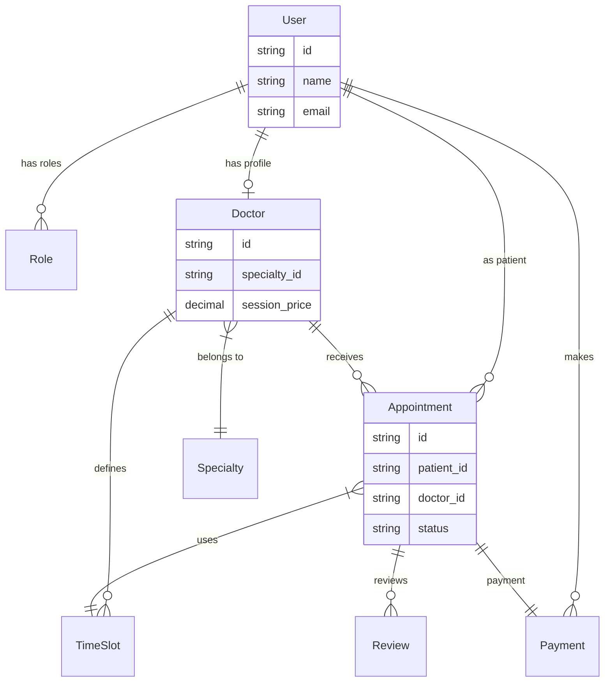

# 🩺 Docto-Rbooking API
[](https://laravel.com)
[](https://php.net)
[](https://laravel.com/docs/sail)
[](https://jwt.io)

A robust, enterprise-grade backend API for a **Doctor Appointment Management System**. Built with a focus on clean architecture, scalability, and strict security standards.

---

## 🏗️ Technical Architecture
This project follows professional software engineering standards:
- **Service-Repository Pattern**: Decoupling business logic from data access for high maintainability.
- **RBAC (Role-Based Access Control)**: Powered by `spatie/laravel-permission` with dedicated roles for **Patients**, **Doctors**, and **Admins**.
- **Atomic Operations**: Ensuring data integrity during appointment bookings and payment processing.
- **Idempotent Scheduling**: Intelligent slot management that handles overlaps gracefully.

---

## 📊 Database Schema (ERD)
The following diagram illustrates the core relationships within the system:



---

## 🚀 Key Features
- **Smart Scheduling**: Bulk-create/update available time slots for doctors with collision detection.
- **Appointment Lifecycle**: Seamless flow from Booking -> Confirmation -> Payment -> Review.
- **Payment Integration**: Webhook support for payment gateways and automated transaction tracking.
- **Search & Filter**: Find doctors by specialty, availability, or ratings.
- **Advanced Auth**: JWT-based authentication with automatic role assignments.

---

## 🛠️ Requirements & Setup

### Prerequisites
- Docker Installed (Desktop/Engine)
- Laravel Sail

### Quick Installation
```bash
# 1. Clone the repository
git clone https://github.com/your-username/Doctor-Booking-API.git
cd Doctor-Booking-API

# 2. Start the environment
./vendor/bin/sail up -d

# 3. Install dependencies
./vendor/bin/sail composer install

# 4. Setup environment
cp .env.example .env
./vendor/bin/sail artisan key:generate
./vendor/bin/sail artisan jwt:secret

# 5. Run migrations and seed the system
./vendor/bin/sail artisan migrate --seed
```

---

## 🧪 Testing with Postman
A comprehensive **Postman Collection** is included in the root directory:
- `Docto-Rbooking-Api.postman_collection.json`
- Includes pre-configured environment variables and **one-click testing** for Admin, Doctor, and Patient flows.

## 👨‍💻 Author
**Muhammad Taha**  
*Backend Developer*

---
*Built with ❤️ using Clean Code principles.*
