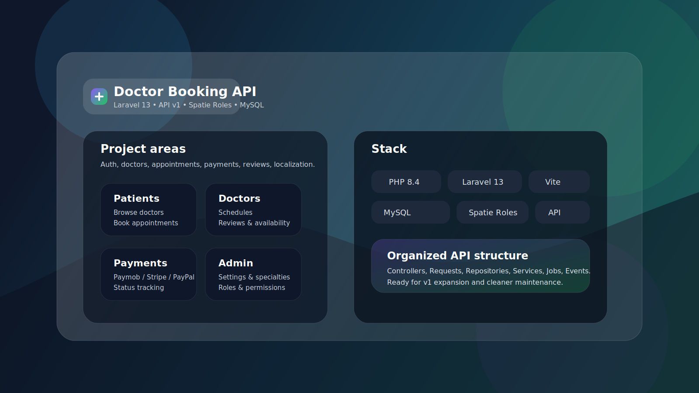

<div align="center">
  
</div>

# 🏥 Doctor Booking API

A state-of-the-art, professional Laravel 13 API designed for scalable healthcare platforms. This project features a robust versioned structure, enterprise-grade architecture, and full Docker integration for seamless development and deployment.

---

## 🌟 Overview

The **Doctor Booking API** provides a comprehensive backend for managing medical appointments, doctor schedules, patient records, and multi-gateway payments. Built with **PHP 8.4** and **Laravel 13**, it adheres to high-performance standards and clean code principles.

## 🚀 Key Features

- **🔐 Advanced Authentication**: Secure JWT-based auth including registration, login, logout, and password recovery.
- **🌐 Social Integration**: Single Sign-On (SSO) support via Google and Facebook.
- **📅 Smart Scheduling**: Complex time-slot management with conflict detection and real-time availability.
- **💳 Payment Gateways**: Fully integrated support for **Stripe**, **Paypal**, and **Kashier**.
- **🌍 Multi-lingual Support**: Polymorphic translation system for dynamic content across multiple locales.
- **🤖 Automated Workflows**: Background jobs for appointment reminders (24h prior) and status updates.
- **🏢 Role-Based Access Control (RBAC)**: Fine-grained permissions for Admins, Doctors, and Patients (via Spatie).
- **⚡ Performance Caching**: Redis-backed caching for doctor availability and search results.
- **✅ Code Quality**: Automated testing suite and strict style enforcement via Laravel Pint.

---

## 🏗️ Technical Stack

### Backend
- **Core**: PHP 8.4 / Laravel 13
- **Database**: MySQL 8.4
- **Cache & Queue**: Redis (Alpine)
- **Auth**: JWT (JSON Web Token) & Laravel Sanctum
- **Permissions**: Spatie Laravel-Permission
- **Mailing**: SMTP (Gmail integration)

### Frontend & Tools
- **Asset Bundling**: Vite 8.0
- **CSS Framework**: Tailwind CSS 4.0
- **Testing**: PHPUnit & Laravel Test Runner
- **Code Style**: Laravel Pint

### DevOps & Infrastructure
- **Containerization**: Docker & Laravel Sail
- **CI/CD**: GitHub Actions (Auto-merge features)
- **Monitoring**: Laravel Pail (Real-time logs)

---

## 📐 Architecture

The project follows a **Modified Repository & Service Pattern** to decouple business logic from persistence.

- **Controllers**: Thin controllers handling only request entry and response delivery.
- **Services**: Centralized business logic (e.g., `AppointmentService`, `PaymentService`).
- **Repositories**: Standardized data access layer with Interface contracts for easy swapping.
- **Models**: Eloquent models with defined relationships and polymorphic capabilities.
- **Requests**: Dedicated form requests for robust input validation.
- **Resources**: API Resources for consistent JSON response structuring.

---

## 🐳 Docker Setup (Recommended)

This project is fully containerized using **Laravel Sail**. This is the standard way to run the application locally.

### Prerequisites
- Docker Desktop installed.
- PHP & Composer installed (only for initial setup).

### Installation Steps

1. **Clone & Install Dependencies**:
   ```bash
   composer install
   ```

2. **Launch Infrastructure**:
   ```bash
   ./vendor/bin/sail up -d
   ```

3. **Initialize Environment**:
   ```bash
   ./vendor/bin/sail artisan key:generate
   ./vendor/bin/sail artisan migrate:fresh --seed
   ```

4. **Build Frontend Assets**:
   ```bash
   ./vendor/bin/sail npm install
   ./vendor/bin/sail npm run build
   ```

5. **Start Development Server**:
   ```bash
   ./vendor/bin/sail npm run dev
   ```

The API will be available at `http://localhost`.

---

## 🧪 Testing & Quality

To run the automated suite:
```bash
./vendor/bin/sail artisan test
```

To check code style:
```bash
./vendor/bin/sail pint --test
```

---

## 📋 Database Schema Summary

| Table | Purpose |
| --- | --- |
| `users` | Unified table for all user types with Spatie roles. |
| `doctors` | Detailed professional records and specialties. |
| `time_slots` | Granular availability windows for each doctor. |
| `appointments` | Transactional records for bookings and status. |
| `payments` | Multi-provider transaction tracking. |
| `translations` | Polymorphic data for localized strings. |

---

## 📄 License
MIT License. Created by **MohammedTaha187**.
